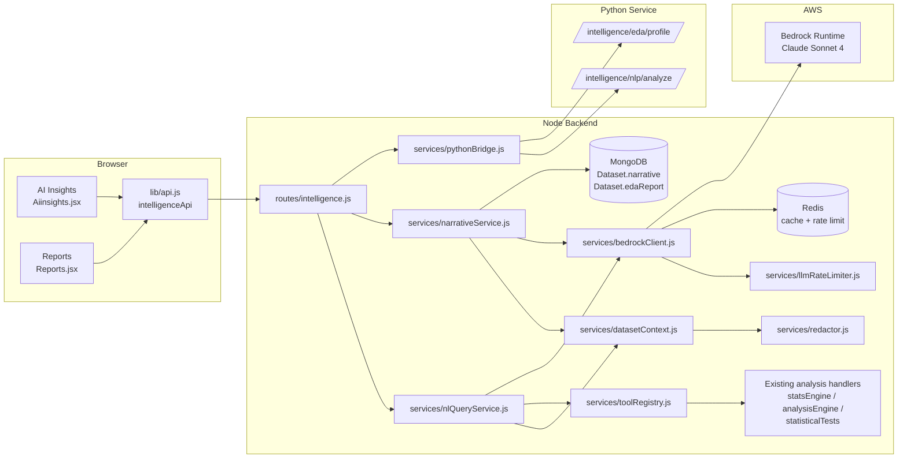
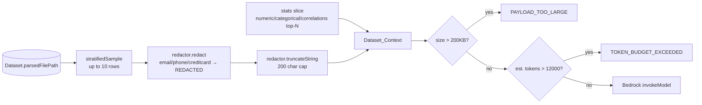
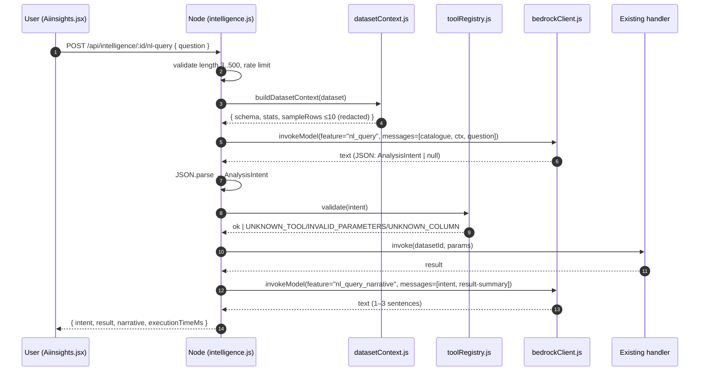
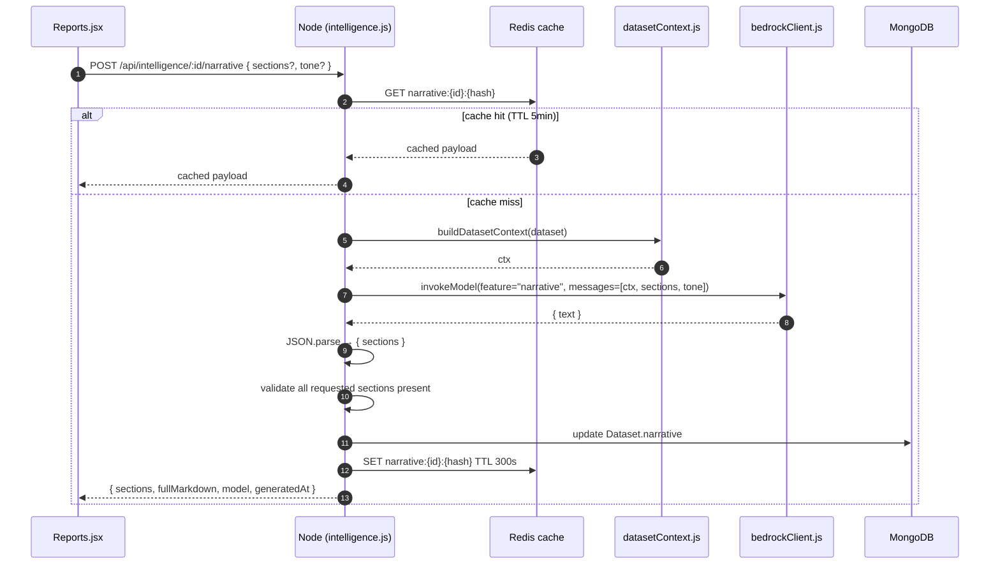
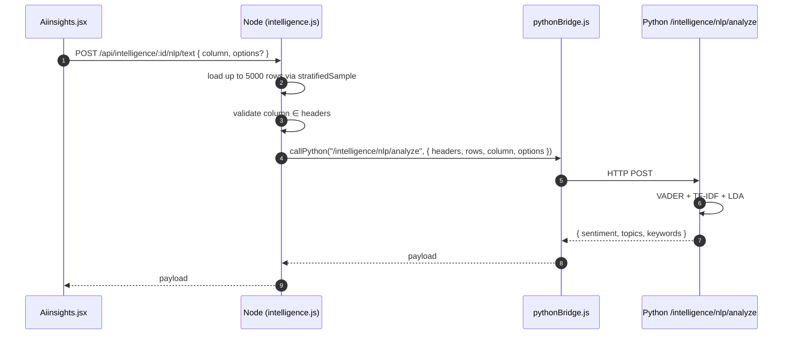
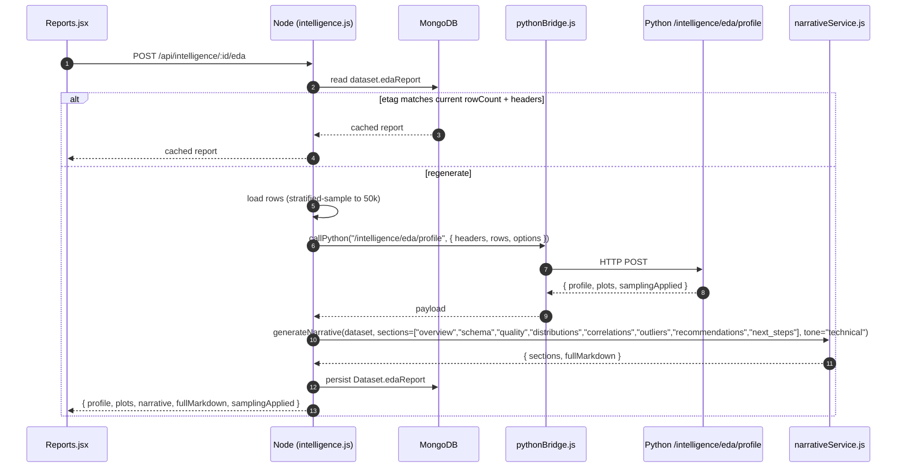

# Design Document — Intelligence Layer

> **Naming constraint.** This feature is implemented as the *Intelligence Layer*. New files, services, route paths, environment-variable subsystem labels, log feature names, and identifiers MUST NOT use `phase3`, `phase4`, or `phase5`. The legacy file `data_backend/routes/phase3.js` is not modified by this feature and is not a template for new naming. Node routes are mounted at `/api/intelligence/*`. Python routes live under `/intelligence/nlp/*` and `/intelligence/eda/*`.

## Overview

The Intelligence Layer adds four LLM-assisted capabilities on top of Obsidian Analytics:

- **5a — Natural Language Queries:** plain-English questions are translated into structured `AnalysisIntent` objects and dispatched to existing analysis handlers (descriptive stats, correlation, regression, k-means, anomaly detection, forecasting, FFT, statistical tests).
- **5b — Auto-Generated Report Narratives:** the dataset's pre-computed `stats` object is summarised into a multi-section markdown narrative.
- **5c — Text Column NLP:** sentiment, topics, and keywords for free-text columns, computed in the Python service with NLTK + scikit-learn.
- **5d — Automated EDA Reports:** a one-click report combining `ydata-profiling` output with an LLM-authored narrative and exportable plots.

All four share a single Bedrock gateway, a redaction pipeline, a token-budget guard, and a structured logging layer. The frontend exposes the new capabilities through the existing **AI Insights** and **Reports** pages — no new routes or pages are introduced.

### Goals

- Reuse existing Phase 1–4 analysis handlers; the LLM only chooses *which* one to run with *which* parameters.
- Send the minimum context to Bedrock: schema + stats + ≤ 10 redacted sample rows.
- Hard payload caps (200 KB) and token budgets (12,000 tokens default) enforced before any external call.
- Structured logging of every LLM invocation, never recording prompt or response bodies.
- Zero functional regression for users who do not have AWS credentials configured: routes return clear `BEDROCK_NOT_CONFIGURED` errors and the frontend hides regenerate controls.

### Non-Goals

- No fine-tuning, agent loops, multi-step tool chaining, or vector storage.
- No streaming responses (request/response only).
- No dataset content sent to AWS beyond schema, stats, and ≤ 10 redacted rows.
- No client-side LLM calls. All Bedrock interaction goes through the Node backend.

---

## Architecture

### High-Level



### Request Flow Summary

| Sub-feature | Trigger | Backend route | Bedrock? | Python? | Persists? |
| --- | --- | --- | --- | --- | --- |
| 5a NL Query | User question on AI Insights | `POST /api/intelligence/:datasetId/nl-query` | yes (intent + narrative) | no | no |
| 5b Narrative | Reports panel / regenerate | `POST /api/intelligence/:datasetId/narrative` | yes | no | `dataset.narrative` |
| 5c Text NLP | "Analyze text" on column | `POST /api/intelligence/:datasetId/nlp/text` | no | yes | no |
| 5d Auto EDA | "Generate EDA Report" | `POST /api/intelligence/:datasetId/eda` | yes (narrative on profile) | yes | `dataset.edaReport` |
| Health | Frontend boot | `GET /api/intelligence/health` | probe | probe | no |

---

## Components and Interfaces

### Module Layout

```
data_backend/
  routes/
    intelligence.js              # NEW — all /api/intelligence/* routes
  services/
    bedrockClient.js             # NEW — AWS Bedrock Runtime wrapper
    datasetContext.js            # NEW — builds Dataset_Context payloads
    redactor.js                  # NEW — PII redaction + truncation
    toolRegistry.js              # NEW — Zod-validated registry of analysis tools
    nlQueryService.js            # NEW — orchestrates NL question → intent → handler
    narrativeService.js          # NEW — orchestrates stats → markdown sections
    llmRateLimiter.js            # NEW — Redis-backed per-user LLM bucket
    promptTemplates.js           # NEW — pure functions returning role-tagged messages
    intelligenceLogger.js        # NEW — structured log emitter (no prompt/response bodies)
  models/
    Dataset.js                   # MODIFIED — adds narrative, edaReport sub-schemas
  config/
    intelligence.js              # NEW — env config loader (with safe defaults)
  routes/
    phase3.js                    # UNCHANGED — legacy, do not imitate
    phase4.js                    # UNCHANGED — legacy, do not imitate

python_service/
  main.py                        # MODIFIED — registers intelligence routers
  intelligence/
    __init__.py                  # NEW
    nlp_routes.py                # NEW — /intelligence/nlp/analyze
    eda_routes.py                # NEW — /intelligence/eda/profile
    nlp_pipeline.py              # NEW — VADER + LDA + TF-IDF helpers
    eda_pipeline.py              # NEW — ydata-profiling wrapper + plot rendering
  requirements.txt               # MODIFIED — adds nltk, ydata-profiling, matplotlib

data_frontend/
  src/
    lib/
      api.js                     # MODIFIED — adds intelligenceApi namespace
      intelligenceMarkdown.js    # NEW — small, dependency-free markdown renderer
      pdfExport.js               # MODIFIED — accepts narrative + EDA report, renders pages
    components/
      intelligence/
        NLQueryBox.jsx           # NEW — chat-style input + result panel
        NarrativePanel.jsx       # NEW — markdown + tone toggle + regenerate
        EDAReportPanel.jsx       # NEW — profile tables + plots + export hook
        TextNlpPanel.jsx         # NEW — sentiment donut + topics + keywords
        IntelligenceErrorBanner.jsx # NEW — surfaces structured error envelope
    pages/
      Aiinsights.jsx             # MODIFIED — mounts NLQueryBox and TextNlpPanel
      Reports.jsx                # MODIFIED — mounts NarrativePanel and EDAReportPanel
```

### Bedrock_Client (`services/bedrockClient.js`)

Public API:

```js
// invokeModel({ feature, messages, schema, datasetId, userId })
//   → { text, model, latencyMs, inputTokensEstimate, outputTokensEstimate, raw }
//
// Throws an error whose .code is one of:
//   BEDROCK_NOT_CONFIGURED, BEDROCK_TIMEOUT, BEDROCK_ERROR,
//   TOKEN_BUDGET_EXCEEDED, PAYLOAD_TOO_LARGE
```

Behaviours:

- Uses `@aws-sdk/client-bedrock-runtime`'s `InvokeModelCommand` with the Anthropic Messages API body shape.
- Default model: `BEDROCK_MODEL_ID` env var, falling back to `anthropic.claude-sonnet-4-20250514-v1:0`.
- Default region: `AWS_REGION`, falling back to `us-east-1`.
- Timeout: `BEDROCK_TIMEOUT_MS` (default 60000) enforced via `AbortController`.
- Retries: 3 attempts with exponential backoff (500ms, 1000ms, 2000ms) on HTTP 429 / 5xx / `ThrottlingException` / `ServiceUnavailableException`. Non-retryable errors (auth, validation, content) fail immediately.
- Token budget guard: estimates input tokens as `ceil(serializedMessages.length / 4)`. Rejects with `TOKEN_BUDGET_EXCEEDED` when above `BEDROCK_TOKEN_BUDGET` (default 12000).
- Payload size guard: rejects with `PAYLOAD_TOO_LARGE` when serialized request body exceeds 200 KB.
- Credentials: if `AWS_ACCESS_KEY_ID` *and* `AWS_SECRET_ACCESS_KEY` are missing AND no IAM role / profile is configured, throws `BEDROCK_NOT_CONFIGURED` synchronously without contacting AWS.
- Structured log per call (via `intelligenceLogger.js`):
  - `{ ts, level, event: "llm.invoke", feature, userId, datasetId, model, inputTokensEstimate, outputTokensEstimate, latencyMs, attempts, outcome }`
  - The `outcome` is `success | timeout | budget_exceeded | payload_too_large | not_configured | retryable_error | non_retryable_error`.
  - **No prompt or response body is ever logged.**

### Tool_Registry (`services/toolRegistry.js`)

A static map of `tool` identifiers to:

```ts
{
  schema: z.ZodObject,           // Parameters schema
  description: string,           // Shown to the LLM in the catalogue
  requiredColumns: (params) => string[],  // Columns referenced by the params
  invoke: async (datasetId, userId, params) => result
}
```

Registered tools (matching the existing handlers — see `data_backend/services/statsEngine.js`, `analysisEngine.js`, `statisticalTests.js`, `pythonBridge.js`):

| Tool ID | Backed by | Notes |
| --- | --- | --- |
| `descriptive_stats` | `statsEngine.computeAllStats` | Returns the dataset's full stats; column filter optional. |
| `correlation` | `statsEngine.computeAllStats` (slice `correlationMatrix`) | Optional `columns` to filter pairs. |
| `regression` | `analysisEngine.regressionAnalysis` | Linear / polynomial / multiple. |
| `kmeans` | `analysisEngine.kMeansAnalysis` | Auto-K supported. |
| `feature_importance` | `analysisEngine.decisionTreeImportance` | Requires `targetColumn`. |
| `anomaly_detection` | `analysisEngine.isolationForestAnalysis` | Configurable contamination. |
| `forecast` | `analysisEngine.holtWintersAnalysis` | Requires date + value column. |
| `fft` | `analysisEngine.fftAnalysis` | Single numeric column. |
| `t_test` | `statisticalTests.tTest` / `oneSampleTTest` | Two-sample by default. |
| `anova` | `statisticalTests.anova` | Group-by categorical column. |
| `chi_square` | `statisticalTests.chiSquareTest` | Two categorical columns. |
| `normality` | `statisticalTests.normalityTest` | Single numeric column. |
| `confidence_intervals` | `statisticalTests.confidenceInterval` | Single numeric column, `level` default 0.95. |

Validation order on dispatch:

1. `intent.tool` is a known key → else `UNKNOWN_TOOL`.
2. `intent.parameters` parses against the registered Zod schema → else `INVALID_PARAMETERS` with `error.issues` from Zod.
3. `requiredColumns(parameters)` are all in `dataset.headers` → else `UNKNOWN_COLUMN`.
4. `invoke(...)` is called with the dataset rows loaded via `getDatasetRows()` (mirrors the helper in `phase3.js`, but copied as a small private helper to avoid importing the legacy file's identifiers).

### Dataset_Context Builder (`services/datasetContext.js`)

`buildDatasetContext(dataset, { sampleRows = 5, maxSampleRows = 10 } = {})`:

1. Reads up to `maxSampleRows` rows from the parsed JSONL via the existing `stratifiedSample` helper.
2. Calls `redactor.redact(rows, semanticTypes)` to sanitise PII columns.
3. Truncates every string field longer than 200 characters to `200 chars + "…"`.
4. Returns:

```ts
type Dataset_Context = {
  schema: { columnTypes: Record<string,string>, headers: string[], rowCount: number };
  qualityFlags: { qualityScore: number, flags: Array<{type: string, detail: string}> };
  numericStats?: Record<string, NumericSummary>;   // up to top 12 numeric cols
  categoricalStats?: Record<string, CategoricalSummary>; // up to top 8 categorical
  timeSeries?: { dateCol: string, primaryCol: string, trendDirection: string, peak, trough } | null;
  correlationInsights?: Array<{ pair: [string,string], r: number, label: string }>; // top 8
  sampleRows: Array<Record<string, unknown>>; // ≤ 10, redacted, truncated
  meta: { tokenBudget: number, datasetId: string };
};
```

Numeric and categorical stats are **trimmed to top-N** (by `nullPct` ascending and `cardinality` descending respectively) to keep the payload small. The full stats object can be 100s of KB on wide datasets — sending all of it is unnecessary and would frequently exceed the 200 KB cap.

### Redactor (`services/redactor.js`)

Pure module. No I/O. Public API:

```js
redact(rows: Row[], semanticTypes: Record<string, {semanticType?: string}>) → Row[]
truncateString(s: string, max=200) → string
estimatePayloadBytes(obj) → number
```

Rules:

- For every column whose `semanticTypes[col].semanticType` is `"email"`, `"phone"`, or `"creditcard"`, replace each cell value with the literal token `"[REDACTED]"`.
- For every other column, if the cell is a string longer than 200 characters, truncate it to `200 + "…"`.
- Numeric, boolean, null, and date values pass through unchanged.
- Returns a new array; does not mutate input.

The redactor never logs cell values. It accepts an optional `audit` callback that is invoked with `{ column, fieldKind, redactedCount }` aggregates only.

### NL_Query_Service (`services/nlQueryService.js`)

```
handleNlQuery({ dataset, userId, question }) →
  { intent, result, narrative, executionTimeMs }
  | { intent: null, suggestion, supportedTools }
```

Steps:

1. Validate question length: 3 ≤ length ≤ 500 → else `INVALID_QUESTION_LENGTH`.
2. Build `Dataset_Context`.
3. Construct a "tool-selection" prompt from `promptTemplates.nlQueryMessages(context, question, registry.catalogue())`.
4. Invoke Bedrock with `feature: "nl_query"`.
5. Parse the response as JSON (strip leading/trailing fences if present). On failure → `INTENT_PARSE_ERROR`.
6. If `intent === null`, return `{ intent: null, suggestion, supportedTools }` (HTTP 200 — this is a normal "I can't answer that" path, not an error).
7. Otherwise, dispatch via Tool_Registry:
   - `UNKNOWN_TOOL` / `INVALID_PARAMETERS` / `UNKNOWN_COLUMN` errors are wrapped in the standard envelope and returned with HTTP 422.
8. Build a follow-up prompt from `promptTemplates.nlQueryNarrative(intent, result)`. Invoke Bedrock again with `feature: "nl_query_narrative"`. Output is a 1–3 sentence plain-English summary.
9. Return `{ intent, result, narrative, executionTimeMs }`.

Bedrock invocations are gated by `llmRateLimiter` (per-user 30/hr).

### Narrative_Service (`services/narrativeService.js`)

```
generateNarrative({ dataset, userId, sections, tone }) →
  { sections: Record<string,string>, fullMarkdown, model, generatedAt }
```

Steps:

1. Default `sections = ["overview", "quality", "trends", "correlations", "outliers", "recommendations"]`.
2. Cache key: `narrative:{datasetId}:{sha1(sections.sort().join("|") + tone)}`.
   - On cache hit (TTL 5 minutes), return cached value with no Bedrock call.
3. If `dataset.stats` is missing, trigger the existing recompute pipeline before continuing.
4. Build `Dataset_Context`.
5. Invoke Bedrock with `promptTemplates.narrativeMessages(context, sections, tone)`.
6. Parse the response as JSON of shape `{ sections: { [name]: string } }`. Reject if any requested section is missing → `INCOMPLETE_NARRATIVE`.
7. Compose `fullMarkdown` by joining each section as `## {Title}\n\n{markdown}`.
8. Persist to `dataset.narrative = { sections, fullMarkdown, model, generatedAt, tone }`.
9. Cache for 5 minutes.

### Python Service Modules

`python_service/intelligence/nlp_routes.py` exposes:

- `POST /intelligence/nlp/analyze` accepting `{ headers, rows, column, options? }` (see Requirement 8). Returns:

```json
{
  "sentiment": {
    "perRow": [-1.0..1.0, ...],
    "summary": { "positive": int, "neutral": int, "negative": int },
    "averageCompound": number
  },
  "topics": [{ "id": int, "weight": number, "terms": ["term", ...] }],
  "keywords": [{ "term": string, "score": number }],
  "rowCount": int,
  "model": "vader+lda+tfidf"
}
```

`python_service/intelligence/eda_routes.py` exposes:

- `POST /intelligence/eda/profile` accepting `{ headers, rows, options? }`. Returns:

```json
{
  "profile": { ... ydata-profiling JSON ... },
  "plots": { "missing_heatmap": "data:image/png;base64,...", ... },
  "samplingApplied": { "applied": bool, "originalRowCount": int, "sampledRowCount": int },
  "elapsedMs": int
}
```

Both routers are registered in `main.py`:

```python
from intelligence.nlp_routes import router as nlp_router
from intelligence.eda_routes import router as eda_router
app.include_router(nlp_router, prefix="/intelligence/nlp", tags=["intelligence"])
app.include_router(eda_router, prefix="/intelligence/eda", tags=["intelligence"])
```

### Frontend Components

| Component | Mounts on | Responsibility |
| --- | --- | --- |
| `NLQueryBox.jsx` | `Aiinsights.jsx` | Free-form input + loading state + result panel rendering intent / result / narrative. |
| `TextNlpPanel.jsx` | `Aiinsights.jsx` | Per-text-column "Analyze" button → `intelligenceApi.nlpText(datasetId, column)` → sentiment donut + topics list + keyword table. |
| `NarrativePanel.jsx` | `Reports.jsx` | Renders `dataset.narrative.fullMarkdown` via `intelligenceMarkdown.js`, tone toggle, regenerate button. |
| `EDAReportPanel.jsx` | `Reports.jsx` | "Generate EDA Report" action, profile table, plot gallery, fed into `pdfExport.js`. |
| `IntelligenceErrorBanner.jsx` | shared | Maps `{ code, message, retryable, retryAfterSeconds? }` to a friendly banner per the cases in Requirement 13. |

`lib/api.js` gains:

```js
export const intelligenceApi = {
  health: () => request('/api/intelligence/health'),
  nlQuery: (datasetId, question) => request(`/api/intelligence/${datasetId}/nl-query`, { method: 'POST', body: { question } }),
  narrative: (datasetId, body) => request(`/api/intelligence/${datasetId}/narrative`, { method: 'POST', body }),
  nlpText: (datasetId, body) => request(`/api/intelligence/${datasetId}/nlp/text`, { method: 'POST', body }),
  edaGenerate: (datasetId) => request(`/api/intelligence/${datasetId}/eda`, { method: 'POST' }),
  edaGet: (datasetId) => request(`/api/intelligence/${datasetId}/eda`),
};
```

---

## Data Models

### AnalysisIntent

```ts
type AnalysisIntent = {
  tool: string;                  // Must match a Tool_Registry key
  parameters: Record<string, unknown>; // Validated against the tool's Zod schema
  columns: string[];             // Columns referenced (subset of dataset.headers)
  rationale: string;             // 1–2 sentence LLM explanation, ≤ 300 chars
};
```

The LLM is instructed to return either an `AnalysisIntent` object or `null` (to signal "I can't map this question").

### Dataset_Context (sent to Bedrock)

See `services/datasetContext.js` description above. Hard upper bound: 200 KB serialized; soft target 50 KB after trimming.

### Dataset model additions (`models/Dataset.js`)

```js
const NarrativeSchema = new mongoose.Schema({
  sections: { type: mongoose.Schema.Types.Mixed, default: {} },
  fullMarkdown: { type: String, default: '' },
  tone: { type: String, enum: ['executive', 'technical'], default: 'executive' },
  model: { type: String, default: '' },
  generatedAt: { type: Date, default: Date.now },
}, { _id: false });

const EdaReportSchema = new mongoose.Schema({
  etag: { type: String, default: '' },                  // sha1(rowCount + headers.join(','))
  profile: { type: mongoose.Schema.Types.Mixed, default: null },
  plots: { type: mongoose.Schema.Types.Mixed, default: {} },
  narrative: { type: mongoose.Schema.Types.Mixed, default: {} },
  fullMarkdown: { type: String, default: '' },
  samplingApplied: { type: mongoose.Schema.Types.Mixed, default: null },
  generatedAt: { type: Date, default: Date.now },
}, { _id: false });

datasetSchema.add({
  narrative: { type: NarrativeSchema, default: null },
  edaReport: { type: EdaReportSchema, default: null },
});
```

### Error Envelope

Every Intelligence Layer route returns failures as:

```json
{
  "code": "BEDROCK_TIMEOUT",
  "message": "Bedrock request exceeded 60s timeout",
  "retryable": true,
  "retryAfterSeconds": 30
}
```

Code catalogue (HTTP status in parentheses):

| Code | When | HTTP | Retryable |
| --- | --- | --- | --- |
| `BEDROCK_NOT_CONFIGURED` | Missing creds at startup or first call | 503 | false |
| `BEDROCK_TIMEOUT` | Hard 60s limit reached | 504 | true |
| `BEDROCK_ERROR` | Non-retryable Bedrock error after retries | 502 | false |
| `TOKEN_BUDGET_EXCEEDED` | Estimated tokens > budget | 413 | false |
| `PAYLOAD_TOO_LARGE` | Serialized payload > 200 KB | 413 | false |
| `LLM_RATE_LIMITED` | Per-user bucket exhausted | 429 | true |
| `INVALID_QUESTION_LENGTH` | length < 3 or > 500 | 400 | false |
| `INTENT_PARSE_ERROR` | LLM returned non-JSON or wrong shape | 502 | true |
| `UNKNOWN_TOOL` | Intent.tool not in registry | 422 | false |
| `INVALID_PARAMETERS` | Zod validation failed | 422 | false |
| `UNKNOWN_COLUMN` | Referenced column missing from headers | 422 | false |
| `INCOMPLETE_NARRATIVE` | Section missing in LLM output | 502 | true |
| `INSUFFICIENT_TEXT_DATA` | < 10 non-empty rows in column | 422 | false |
| `PYTHON_UNAVAILABLE` | NLP/EDA service unreachable | 503 | true |
| `INTELLIGENCE_DISABLED` | `INTELLIGENCE_LAYER_ENABLED=false` | 503 | false |

---

## Tool Registry (Zod Schemas)

```js
// services/toolRegistry.js
import { z } from 'zod';

const ColumnRef = z.string().min(1);

export const TOOL_SCHEMAS = {
  descriptive_stats: z.object({
    columns: z.array(ColumnRef).optional(),
  }),

  correlation: z.object({
    columns: z.array(ColumnRef).min(2).optional(),
    threshold: z.number().min(0).max(1).optional(),
  }),

  regression: z.object({
    type: z.enum(['linear', 'polynomial', 'multiple']).default('linear'),
    xColumn: ColumnRef.optional(),
    xColumns: z.array(ColumnRef).optional(),
    yColumn: ColumnRef,
    degree: z.number().int().min(1).max(5).optional(),
  }),

  kmeans: z.object({
    columns: z.array(ColumnRef).optional(),
    k: z.number().int().min(2).max(20).optional(),
    autoSelect: z.boolean().optional(),
    maxK: z.number().int().min(2).max(20).optional(),
  }),

  feature_importance: z.object({
    targetColumn: ColumnRef,
    criterion: z.enum(['gini', 'entropy', 'variance']).optional(),
    maxDepth: z.number().int().min(1).max(20).optional(),
  }),

  anomaly_detection: z.object({
    columns: z.array(ColumnRef).optional(),
    contamination: z.number().min(0.001).max(0.5).optional(),
    nTrees: z.number().int().min(10).max(500).optional(),
  }),

  forecast: z.object({
    dateColumn: ColumnRef,
    valueColumn: ColumnRef,
    seasonLength: z.number().int().min(2).max(365).optional(),
    forecastPeriods: z.number().int().min(1).max(365).optional(),
  }),

  fft: z.object({
    column: ColumnRef,
    sampleRate: z.number().positive().optional(),
  }),

  t_test: z.object({
    column: ColumnRef,
    groupColumn: ColumnRef.optional(),
    hypothesizedMean: z.number().optional(),
  }),

  anova: z.object({
    valueColumn: ColumnRef,
    groupColumn: ColumnRef,
  }),

  chi_square: z.object({
    columnA: ColumnRef,
    columnB: ColumnRef,
  }),

  normality: z.object({
    column: ColumnRef,
  }),

  confidence_intervals: z.object({
    column: ColumnRef,
    level: z.number().min(0.5).max(0.999).optional(),
  }),
};
```

The registry exposes a `catalogue()` helper that returns a compact list `{ tool, description, parameterSchemaJson }` (using `zod-to-json-schema` transformations) — this is what the LLM sees when choosing a tool.

---

## Bedrock Client Internals

```js
// services/bedrockClient.js (sketch)
import { BedrockRuntimeClient, InvokeModelCommand } from '@aws-sdk/client-bedrock-runtime';
import { intelligenceConfig } from '../config/intelligence.js';
import { logEvent } from './intelligenceLogger.js';

let _client = null;
function getClient() {
  if (_client) return _client;
  const cfg = intelligenceConfig();
  if (!cfg.credentialsResolved) {
    const err = new Error('AWS credentials are not configured');
    err.code = 'BEDROCK_NOT_CONFIGURED';
    throw err;
  }
  _client = new BedrockRuntimeClient({ region: cfg.region });
  return _client;
}

export async function invokeModel({ feature, messages, datasetId, userId, modelOverride }) {
  const cfg = intelligenceConfig();
  const model = modelOverride || cfg.modelId;
  const body = {
    anthropic_version: 'bedrock-2023-05-31',
    max_tokens: 2000,
    temperature: 0.2,
    messages,
  };
  const serialized = JSON.stringify(body);
  if (serialized.length > 200_000) throw withCode('PAYLOAD_TOO_LARGE', 'Payload exceeds 200KB');
  const tokenEstimate = Math.ceil(serialized.length / 4);
  if (tokenEstimate > cfg.tokenBudget) throw withCode('TOKEN_BUDGET_EXCEEDED', `Estimated ${tokenEstimate} tokens > budget ${cfg.tokenBudget}`);

  const client = getClient();
  const start = Date.now();
  let attempts = 0, lastErr = null;
  for (; attempts < 3; attempts++) {
    const ac = new AbortController();
    const t = setTimeout(() => ac.abort(), cfg.timeoutMs);
    try {
      const resp = await client.send(new InvokeModelCommand({
        modelId: model,
        contentType: 'application/json',
        accept: 'application/json',
        body: serialized,
      }), { abortSignal: ac.signal });
      clearTimeout(t);
      const text = decodeAnthropicText(resp.body);
      const latencyMs = Date.now() - start;
      logEvent({ event: 'llm.invoke', feature, userId, datasetId, model, inputTokensEstimate: tokenEstimate, latencyMs, attempts: attempts + 1, outcome: 'success' });
      return { text, model, latencyMs, inputTokensEstimate: tokenEstimate };
    } catch (err) {
      clearTimeout(t);
      lastErr = err;
      if (ac.signal.aborted) { const e = withCode('BEDROCK_TIMEOUT', 'Bedrock request timed out'); logEvent({ event: 'llm.invoke', feature, userId, datasetId, model, latencyMs: Date.now() - start, attempts: attempts + 1, outcome: 'timeout' }); throw e; }
      if (!isRetryable(err)) break;
      await sleep(500 * (2 ** attempts));
    }
  }
  logEvent({ event: 'llm.invoke', feature, userId, datasetId, model, latencyMs: Date.now() - start, attempts, outcome: 'non_retryable_error' });
  throw withCode('BEDROCK_ERROR', lastErr?.message || 'Bedrock invocation failed');
}
```

`isRetryable` handles `ThrottlingException`, `ServiceUnavailableException`, HTTP 429, and 5xx. The Bedrock client and AWS SDK are added as dependencies of `data_backend/package.json`:

```json
"@aws-sdk/client-bedrock-runtime": "^3.685.0",
"zod-to-json-schema": "^3.23.5"
```

`zod` is already present.

---

## Privacy and Redaction Pipeline



Decisions:

- Sample size cap is 10 rows always — the 5-row default is for narrative use, the cap of 10 is a hard ceiling enforced by `datasetContext.js`.
- The redactor uses `dataQuality.inferSemanticTypes` results that are already produced during dataset processing. If they are missing for the active dataset, a one-shot inference is run before redaction.
- A column-name heuristic complements the semantic-type detector: any column whose lower-cased name matches `/email|phone|mobile|cell|ssn|tax|card|cvv|account/` is redacted regardless of type confidence. This catches sparsely populated PII columns the detector might miss.
- The full prompt body is **not** logged. Only aggregate counts (e.g. `redactedCount: 42`) are emitted.

---

## Sequence Diagrams

### 5a — Natural Language Query



### 5b — Narrative Generation



### 5c — Text NLP



### 5d — Auto EDA



---

## Caching Strategy

| Object | Where | Key | TTL / Invalidation |
| --- | --- | --- | --- |
| Narrative response | Redis | `intelligence:narrative:{datasetId}:sha1(sections+tone)` | 300s TTL |
| Latest narrative per dataset | MongoDB `Dataset.narrative` | `{datasetId}` | Overwritten on regenerate; cleared when dataset is recomputed |
| EDA report | MongoDB `Dataset.edaReport` | `{datasetId, etag}` | `etag` = `sha1(rowCount + "\u0000" + headers.join("\u0000"))`. Regenerated when `etag` changes (i.e. dataset rows or schema changed) |
| Tool catalogue | In-process | static | reset on process restart |
| Bedrock client | In-process | singleton | reset on process restart |

NL Query results are intentionally **not** cached: the LLM may legitimately produce different intents for paraphrased questions, and caching would suppress that signal. Per-call cost is bounded by the per-user rate limit.

---

## Rate Limiting Strategy

Two layers compose:

1. **`apiLimiter`** (existing): 100 req/min per IP across `/api/*` already mounted in `server.js`. Applied to `/api/intelligence/*` by mounting the same limiter on the new router.

2. **`llmRateLimiter`** (new): per-user 30 LLM invocations / hour, implemented with Redis `INCR` + `EXPIRE`:

```js
// services/llmRateLimiter.js (sketch)
export async function checkLlmBudget(userId) {
  const key = `intelligence:llm:budget:${userId}`;
  const conn = getRedisConnection();
  const count = await conn.incr(key);
  if (count === 1) await conn.expire(key, 3600);
  if (count > 30) {
    const ttl = await conn.ttl(key);
    const err = new Error('Per-user LLM budget exceeded');
    err.code = 'LLM_RATE_LIMITED';
    err.retryAfterSeconds = ttl > 0 ? ttl : 3600;
    throw err;
  }
}
```

Routes that invoke Bedrock call `checkLlmBudget(req.userId)` *before* building the context. Text NLP and the cached EDA path do not consume budget; the EDA narrative step does (via `narrativeService`).

If Redis is unreachable, the limiter fails open with a warning log entry — consistent with how the existing job queue handles Redis outages.

---

## Frontend Component Design

### AI Insights — `NLQueryBox.jsx`

- Single-line input above the existing template grid.
- Submit triggers `intelligenceApi.nlQuery(datasetId, question)`.
- States: `idle | loading | success | refused | error`.
- On `success`: render the narrative in a card, the matched tool name with a small badge, parameters as a `<dl>`, and a result panel chosen by `tool`:
  - `kmeans` → reuse existing `KMeansPanel`.
  - `regression` → `RegressionPanel`.
  - `anomaly_detection` → `AnomalyDetectionPanel`.
  - `feature_importance` → `FeatureImportancePanel`.
  - `forecast` → `ForecastPanel`.
  - `fft` → `FFTPanel`.
  - All others → a small `<JsonPreview>` block.
- On `refused`: render `suggestion` + a list of supported tool buttons that, when clicked, pre-fill the input with a templated question.
- On `error`: render `IntelligenceErrorBanner`.

### AI Insights — `TextNlpPanel.jsx`

- Detects text columns from `stats.textColumns`.
- For each text column shows a small "Analyze text" button. Clicking runs `intelligenceApi.nlpText(datasetId, { column })`.
- Result panel has three regions:
  - **Sentiment donut**: positive / neutral / negative counts (uses existing `DonutChart`).
  - **Topics list**: each topic shown as a chip group of its top 8 terms.
  - **Keyword table**: top 20 keywords with their TF-IDF score bar.
- `INSUFFICIENT_TEXT_DATA` is rendered as the exact copy required by Requirement 9.4.

### Reports — `NarrativePanel.jsx`

- Reads `dataset.narrative` from the `DatasetContext` if present; otherwise calls `intelligenceApi.narrative` once on mount.
- `intelligenceMarkdown.js` renders the markdown with these tags only: `h1`–`h4`, `p`, `ul`, `ol`, `li`, `strong`, `em`, `code`, `blockquote`, `a` (rel=nofollow). All other HTML is stripped to prevent injection.
- Tone toggle (`executive` / `technical`) and Regenerate button trigger a new POST.
- While loading, the Regenerate button is disabled and an inline spinner is shown.

### Reports — `EDAReportPanel.jsx`

- "Generate EDA Report" button that calls `intelligenceApi.edaGenerate`.
- During the call (which can take up to 90s) shows a progress card with the message specified in Requirement 11.4 and an indeterminate progress bar.
- After completion, renders:
  - The narrative markdown above the data tables.
  - A table per top-level profile section (variables, missing, correlations).
  - A grid of plot images (each ``).
- The Reports `Export PDF` action calls `pdfExport.exportReportToPDF(dataset, { includeNarrative: true, includeEda: true })`. `pdfExport.js` is updated to consume `dataset.narrative.fullMarkdown` and `dataset.edaReport.{narrative.fullMarkdown, plots}` if present, adding new pages after the existing report.

### Visual Reuse

No new pages are added. The layout, styling, and color palette of existing components are reused — `bg-surface-container-low`, `border-outline-variant/10`, and the Material Symbols icon set remain consistent.

---

## Configuration

`data_backend/config/intelligence.js`:

```js
import 'dotenv/config';
export function intelligenceConfig() {
  const enabled = (process.env.INTELLIGENCE_LAYER_ENABLED ?? 'true').toLowerCase() !== 'false';
  const region = process.env.AWS_REGION || 'us-east-1';
  const modelId = process.env.BEDROCK_MODEL_ID || 'anthropic.claude-sonnet-4-20250514-v1:0';
  const tokenBudget = Number(process.env.BEDROCK_TOKEN_BUDGET || 12000);
  const timeoutMs = Number(process.env.BEDROCK_TIMEOUT_MS || 60000);
  const credentialsResolved = !!(process.env.AWS_ACCESS_KEY_ID && process.env.AWS_SECRET_ACCESS_KEY)
    || !!process.env.AWS_PROFILE
    || !!process.env.AWS_ROLE_ARN;
  return { enabled, region, modelId, tokenBudget, timeoutMs, credentialsResolved };
}
```

`.env.example` additions (Node):

```env
INTELLIGENCE_LAYER_ENABLED=true
AWS_REGION=us-east-1
AWS_ACCESS_KEY_ID=
AWS_SECRET_ACCESS_KEY=
BEDROCK_MODEL_ID=anthropic.claude-sonnet-4-20250514-v1:0
BEDROCK_TOKEN_BUDGET=12000
BEDROCK_TIMEOUT_MS=60000
```

`server.js` is updated to register the new router:

```js
import intelligenceRoutes from './routes/intelligence.js';
app.use('/api/intelligence', apiLimiter, intelligenceRoutes);
```

The `INTELLIGENCE_LAYER_ENABLED=false` short-circuit is implemented as a router-level middleware that returns `{ code: 'INTELLIGENCE_DISABLED', message: 'Intelligence layer is disabled in this environment', retryable: false }` with HTTP 503 — except for `GET /api/intelligence/health` which always responds.

---

## Correctness Properties

*A property is a characteristic or behavior that should hold true across all valid executions of a system — essentially, a formal statement about what the system should do. Properties serve as the bridge between human-readable specifications and machine-verifiable correctness guarantees.*

The Intelligence Layer combines pure logic (redactor, payload builder, tool registry, error envelope mapping) with external IO (Bedrock, Python service, MongoDB). Property-based tests cover the **pure layer**; integration and example-based tests cover the IO layer. The properties below are the testable universal claims; non-testable items are listed under "Open Questions / Risks".

### Property 1: Redactor never leaks PII column values

*For any* set of rows and any column whose semantic type is `email`, `phone`, or `creditcard`, the output of `redact(rows, semanticTypes)` SHALL contain the literal token `"[REDACTED]"` in that column for every row, and SHALL NOT contain any of the original cell values for that column anywhere in the returned structure.

**Validates: Requirements 2.4**

### Property 2: Sample size never exceeds 10

*For any* dataset and any options passed to `buildDatasetContext`, the resulting `Dataset_Context.sampleRows.length` SHALL be ≤ 10.

**Validates: Requirements 2.1, 2.2**

### Property 3: Long string truncation is bounded and idempotent

*For any* string `s`, `truncateString(s, 200)` SHALL return a string of length ≤ 201 characters (200 chars + ellipsis) and applying `truncateString` a second time SHALL return the same value.

**Validates: Requirements 2.3**

### Property 4: Payload size cap is enforced before Bedrock call

*For any* messages array whose `JSON.stringify` length exceeds 200,000 bytes, `bedrockClient.invokeModel` SHALL throw an error with `code === "PAYLOAD_TOO_LARGE"` without contacting AWS.

**Validates: Requirements 2.5**

### Property 5: Token budget is enforced before Bedrock call

*For any* configured `tokenBudget` and any messages whose `ceil(serialized.length / 4)` exceeds it, `bedrockClient.invokeModel` SHALL throw an error with `code === "TOKEN_BUDGET_EXCEEDED"` without contacting AWS.

**Validates: Requirements 1.7**

### Property 6: Tool registry never dispatches to unknown tools

*For any* `AnalysisIntent` whose `tool` key is not present in `TOOL_SCHEMAS`, the dispatcher SHALL return an error with `code === "UNKNOWN_TOOL"` and SHALL NOT call any registered handler.

**Validates: Requirements 3.3**

### Property 7: Tool registry never dispatches with invalid parameters

*For any* `AnalysisIntent` whose `tool` is registered but whose `parameters` fail Zod validation, the dispatcher SHALL return an error with `code === "INVALID_PARAMETERS"` and a non-empty `issues` array, and SHALL NOT call the handler.

**Validates: Requirements 3.4**

### Property 8: Tool registry rejects references to columns not present

*For any* `AnalysisIntent` whose validated parameters reference a column not in `dataset.headers`, the dispatcher SHALL return an error with `code === "UNKNOWN_COLUMN"` and SHALL NOT call the handler.

**Validates: Requirements 3.5**

### Property 9: Question length validation is total and exact

*For any* string `question`, `handleNlQuery` SHALL accept it iff `3 ≤ question.length ≤ 500`; for all other lengths it SHALL return `code === "INVALID_QUESTION_LENGTH"` and SHALL NOT contact Bedrock.

**Validates: Requirements 4.9**

### Property 10: Narrative cache key is deterministic for equal inputs

*For any* two narrative requests with the same `datasetId`, the same set of `sections` (regardless of array order), and the same `tone`, the computed cache key SHALL be identical.

**Validates: Requirements 6.8**

### Property 11: Narrative response includes every requested section

*For any* successful narrative request, the returned `sections` object SHALL contain a value for every name in the requested `sections` array; if any is missing, the service SHALL return `code === "INCOMPLETE_NARRATIVE"`.

**Validates: Requirements 6.5**

### Property 12: EDA etag is stable for stable schemas

*For any* dataset, `etag(rowCount, headers)` SHALL be identical across calls when `rowCount` and `headers` are unchanged, and SHALL change whenever `rowCount` or any header changes.

**Validates: Requirements 10.7, 10.8**

### Property 13: Error envelope shape is uniform

*For any* error returned by an `/api/intelligence/*` route, the response body SHALL contain `code` (string), `message` (string), and `retryable` (boolean) properties.

**Validates: Requirements 13.1**

### Property 14: Per-user LLM budget caps invocations within the window

*For any* user, no more than 30 successful LLM invocations SHALL pass `checkLlmBudget` within any rolling 1-hour window when Redis is reachable; the 31st call SHALL throw `code === "LLM_RATE_LIMITED"`.

**Validates: Requirements 12.4**

### Property 15: Disabled mode short-circuits without external calls

*For any* request to `/api/intelligence/*` (except `/health`) when `INTELLIGENCE_LAYER_ENABLED=false`, the response SHALL be HTTP 503 with `code === "INTELLIGENCE_DISABLED"`, and no Bedrock or Python call SHALL be attempted.

**Validates: Requirements 12.2**

### Property 16: NLP rejects insufficient text data

*For any* column with fewer than 10 non-empty values, `POST /intelligence/nlp/analyze` SHALL return `code === "INSUFFICIENT_TEXT_DATA"` without running LDA or TF-IDF.

**Validates: Requirements 8.6**

### Property 17: Logger never includes prompt or response bodies

*For any* invocation of `intelligenceLogger.logEvent`, the emitted log object SHALL NOT contain any field whose key is `prompt`, `messages`, `responseBody`, `text`, or `body`, and SHALL NOT contain any string field whose value matches any cell originally read from the dataset (a probabilistic check using a sentinel-marker table generated by the test).

**Validates: Requirements 1.8, 12.5**

---

## Property Reflection (redundancy review)

- Properties 4 and 5 are distinct guards (size in bytes vs. tokens) and run on different conditions; not merged.
- Properties 6, 7, and 8 are nested validation gates; each catches a different failure mode and is implemented in a separate branch — keeping them split makes test failures point straight at the gate. They are not consolidated.
- Property 1 and Property 17 may seem to overlap, but Property 1 is about the **payload** and Property 17 is about the **log line**; they exercise different code paths.
- Property 2 (sample cap) and Property 4 (200 KB cap) are independent; one is a count cap, one is a byte cap. Datasets with wide schemas can pass the row cap but fail the byte cap.
- Properties 10 and 12 are both "deterministic key" properties but operate on different entities (cache key vs. etag) with different inputs.

No redundant property is removed.

---

## Error Handling

- All routes wrap their handlers with a small `wrap(fn)` helper that catches errors, maps them to the envelope using a code → status table, and emits a single structured log line.
- Errors from Zod, AWS SDK, the Python bridge, and Redis are translated to known codes; unknown errors fall through to `BEDROCK_ERROR` (502) for LLM calls, or `INTERNAL_ERROR` (500) otherwise.
- The frontend's `IntelligenceErrorBanner` renders friendly copy for the codes listed in Requirement 13. For unknown codes it falls back to the generic message.

---

## Testing Strategy

PBT applies to: redactor, payload builder, token budget guard, tool registry validator, question-length validator, etag computation, cache-key derivation, error envelope shape, rate-limiter math.

PBT does **not** apply to: `pdfExport.js` rendering output (snapshot tests), the React panels (component tests with mocks), Bedrock SDK behaviour (integration smoke), Python service endpoints (1–2 example tests).

### Test layers

- **Unit (Vitest, Node)** — `data_backend/tests/`:
  - `redactor.test.js` — examples (PII columns redacted, non-PII unchanged) + edge cases (null cells, mixed types).
  - `datasetContext.test.js` — slicing/trimming behaviour.
  - `bedrockClient.test.js` — token budget and payload size guards (with mocked SDK), retry on 429, abort on timeout. Anything that contacts AWS is mocked via `aws-sdk-client-mock`.
  - `toolRegistry.test.js` — Zod parses, unknown tool rejection, column-existence checks.
  - `narrativeService.test.js` — caching key determinism, missing-section detection, persistence side-effect (mocked Mongo).
  - `nlQueryService.test.js` — refusal path (LLM returns null), happy path (mocked Bedrock + mocked handler), validation errors.
  - `llmRateLimiter.test.js` — 30 allow, 31st reject, TTL math.

- **Property-based (Vitest + `fast-check`)** — `data_backend/tests/properties.intelligence.test.js`:
  - Implements Properties 1, 2, 3, 4, 5, 6, 7, 8, 9, 10, 12, 13, 14, 15, 16, 17.
  - Each property test runs ≥ 100 iterations.
  - Each property test is tagged as `// Feature: intelligence-layer, Property N: <text>`.
  - `fast-check` is added to `data_backend` devDependencies.

- **Python tests** (`python_service/tests/`, `pytest`):
  - `test_nlp_routes.py` — example tests for sentiment, topic, keyword shape; one property test using `hypothesis` for "any column with ≥ 10 values produces well-formed output" and Property 16 ("< 10 values rejects with INSUFFICIENT_TEXT_DATA").
  - `test_eda_routes.py` — smoke test against a small CSV; verify `samplingApplied` flag toggles at 50k threshold.

- **Frontend tests** (`data_frontend/src/components/intelligence/__tests__`, Vitest + `@testing-library/react`):
  - `NLQueryBox.test.jsx` — loading/success/refused/error states using a mocked fetch.
  - `NarrativePanel.test.jsx` — markdown rendering does not produce `<script>` or `<iframe>` for any input (PBT with `fast-check` over random HTML strings, Property: "for all strings, the rendered output contains zero `<script` substrings").
  - `EDAReportPanel.test.jsx` — generate flow + cached-fetch flow.

### Test infrastructure

- `aws-sdk-client-mock` for Bedrock.
- `fast-check` for Node PBT (≥ 100 iterations).
- `hypothesis` for Python PBT.
- A shared fixture builder `tests/fixtures/datasetFixtures.js` produces datasets of varying size and shape (numeric-heavy, text-heavy, mixed), used as inputs to property tests.

### Coverage targets

- `redactor.js`, `datasetContext.js`, `toolRegistry.js`, `bedrockClient.js`, `intelligenceLogger.js`: 100% line and branch.
- `nlQueryService.js`, `narrativeService.js`, `intelligence.js` (routes): ≥ 90% line, including all error branches.
- Frontend panels: smoke level only (mounted, key states render).

---

## Risks and Open Questions

1. **AWS credential model in CI.** The repo currently has no AWS credentials. CI must skip integration tests that contact Bedrock; unit tests use `aws-sdk-client-mock` so the build remains green without AWS access.

2. **`ydata-profiling` install footprint.** The package and its transitive deps (matplotlib, seaborn, htmlmin, multimethod) add roughly 300 MB to the Python image. Mitigation: keep the import inside the route handler so the Python service still boots if `ydata-profiling` is unavailable, returning `PYTHON_UNAVAILABLE` until installed.

3. **NLTK model download.** VADER lexicon is bundled in `nltk_data`; the Docker image must run `python -m nltk.downloader vader_lexicon` at build time. Document this in the Python `Dockerfile` change.

4. **Token estimation accuracy.** The `length / 4` heuristic is a coarse approximation. If users hit `TOKEN_BUDGET_EXCEEDED` falsely, we can swap in `@anthropic-ai/tokenizer` later — but it ships a 1.4 MB WASM bundle, so it is intentionally deferred.

5. **Concurrent regenerates of the same narrative.** Two concurrent regenerate clicks for the same dataset can both pass the cache miss check and both invoke Bedrock. Mitigation (out of scope for v1): a Redis SETNX-based "in flight" lock with a 60s TTL. Documented as a follow-up.

6. **PDF rendering of plots.** `jsPDF` does not natively support data URIs from arbitrary PNG sizes. The EDA panel resizes plots to ≤ 800×600 server-side; client-side `pdfExport.js` further re-encodes if needed.

7. **`markdown` injection surface in `intelligenceMarkdown.js`.** Building a custom mini-renderer is necessary because no markdown library is currently a frontend dep, and adding one expands the bundle. The renderer is whitelist-based and round-tripped against a hostile-input test corpus (Property in `NarrativePanel.test.jsx`).

8. **Multi-tenant log noise.** With 30 LLM calls per user per hour and no upper cap on user count, log volume can grow quickly. The structured logger is wired to `console.log` for v1; an upgrade path (pino + log shipping) is out of scope.

9. **Streaming responses.** Out of scope for v1. If we add streaming later, the contract changes from "return JSON" to "return SSE/`text/event-stream`", so the frontend `intelligenceApi` is intentionally written as a thin wrapper that can be swapped without page changes.

10. **Sonnet 4 prompt-format compatibility.** Anthropic's Bedrock contract is the same for Sonnet 3.5 and Sonnet 4 (`anthropic_version: "bedrock-2023-05-31"`, `messages` array). If AWS later requires a different `anthropic_version` for Sonnet 4, only `bedrockClient.js` changes.

---

## Summary

The Intelligence Layer is intentionally thin: a single Bedrock gateway, a deterministic context builder, a Zod-validated tool registry, and two Python endpoints — wired into existing pages with reusable components. Hard caps (10 sample rows, 200 KB, 12,000 tokens, 30 LLM calls/user/hour) and a structured error envelope keep cost, privacy, and operability under control. Nothing in this design uses `phase3`, `phase4`, or `phase5` as identifiers; the legacy `data_backend/routes/phase3.js` is left untouched.
